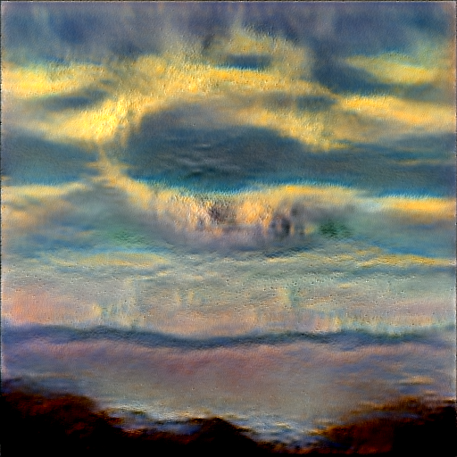

# MuseLink

***Repo details go here!***

Make sure you also read `READMEFIRST.txt`.

Put the model, `paray-512px.pt`, in the models folder!

To use CLI, run setup.py with paths to the model, nlist, factor, and latentexplore dir. Values should be okay by default.
